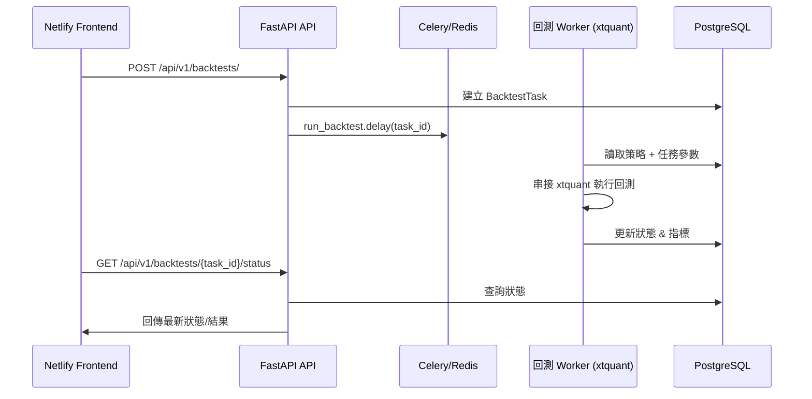

# Lazybacktest 雲端化架構藍圖（版本代碼：LB-ARCH-0001）

本文件對齊公司 Netlify 前端 + 雲端後端部署需求，將原始 PyQt 桌面系統拆分為三層：

1. **前端（Netlify 靜態部署）**
   - 技術棧：Next.js 14 + TypeScript + Chakra UI。
   - 特色：
     - Static Site Generation + Incremental Static Regeneration，確保日流量 1 萬 / 日活 6000 的載入速度。
     - 響應式設計與無障礙標準，兼顧手機用戶使用者旅程。
     - 透過 `NEXT_PUBLIC_API_BASE_URL` 與後端 API 整合，並預留 SSE/WebSocket 擴充位置。

2. **後端（FastAPI + Celery）**
   - 技術棧：FastAPI、SQLAlchemy、PostgreSQL、Celery、Redis。
   - 職責：
     - 提供策略 CRUD 與回測佇列 API。
     - 以 Celery 非同步執行回測，確保耗時計算不阻塞前端互動。
     - `app/adapters/xtquant.py` 封裝 xtquant/MiniQMT 互動邏輯。

3. **任務層（xtquant Windows 環境）**
   - 建議部署於 Windows Server 或容器化 Wine 環境，負責實際回測與交易指令。

## 核心資料流程

## Netlify 佈署流程

1. `netlify.toml` 指定 `frontend` 作為 build base，`next build` + `next export` 產出靜態檔。
2. 透過 Netlify Edge Functions 或 API Proxy 將 `/api/` 流量轉向雲端 FastAPI 域名。
3. 建議使用 CloudFront / Cloudflare 為 API 提供 CDN 與 WAF。

## 後續擴充建議

- 導入 `app/api/v1/streams` 模組提供 SSE/WebSocket，即時推播回測進度。
- 以 OpenAPI schema 自動生成 TypeScript client，降低前後端溝通成本。
- 透過 Terraform/Ansible 建立基礎設施即程式碼，確保多環境一致性。
- 對 Celery 任務導入 Prometheus 指標，方便監控任務佇列健康度。

本藍圖確保原始回測與策略管理功能可完整覆蓋於雲端環境，並滿足高流量、高可用需求。
